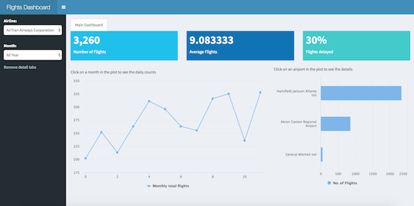

# Databases with RStudio

These files demonstrate how to use RStudio and databases. Make sure to install the latest versions of the `dplyr` and `DBI` packages. Also, install these dev versions of `odbc` and `dbplyr`.

```
install.packages("DBI")
install.packages("dplyr")
install.packages("config")
devtools::install_github("odbc")
devtools::install_github("dbplyr")
```

### 1. Query methods

There are many ways to query data with R. This document shows you three of the most common ways to query data:

1. Using DBI
2. Using dplyr syntax
3. Using R Notebooks

### 2. Flights dashboard

Inside the enterprise, a dashboard is expected to have up-to-the-minute information, to have a fast response time despite the large amount of data that supports it, and to be available on any device. An end user may expect that clicking on a bar or column inside a plot will result in either a more detailed report, or a list of the actual records that make up that number. This article will cover how to use a set of R packages, along with Shiny, to meet those requirements.

* [Background](https://rviews.rstudio.com/2017/09/20/dashboards-with-r-and-databases/)
* [Code](https://gist.github.com/edgararuiz/876ba4718e56af66c3e1181482b6cb99)
* [Live app](http://colorado.rstudio.com/rsc/flights-dashboard-teradata/)



### 3. Basics

The `dplyr` and `DBI` packages gives you a wide variety of tools for the following operations:

* Connect to your database
* Operate on your tables
* Query your data
* Translate your `dplyr` code into SQL


